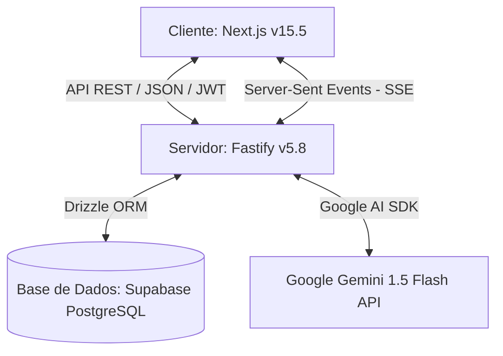

# Relatório Técnico de Desenvolvimento - Emanus IA (Plataforma EMAIT)

Este relatório descreve as ferramentas, tecnologias, infraestrutura e arquitetura utilizadas para o desenvolvimento da plataforma educativa **Emanus IA (EMAIT)**, bem como as diretrizes necessárias para aceder à conta administrativa.

---

## 1. Visão Geral da Arquitetura

A plataforma **Emanus IA** foi desenhada seguindo um padrão de **Monorrepósito Desacoplado**, onde o cliente (Frontend) e o servidor (Backend) residem no mesmo repositório de desenvolvimento, mas são executados e implementados como serviços separados.



### Principais fluxos de integração:
1. **Comunicação por Streaming**: O Frontend envia a pergunta do aluno e o histórico de conversação para o Backend via HTTP POST. O Backend comunica com a API do Gemini e faz o streaming da resposta em tempo real de volta para o cliente usando **Server-Sent Events (SSE)**.
2. **Síntese de Voz Nativa (TTS)**: O Frontend processa o texto streamado em tempo real, dividindo-o em frases completas e reproduzindo-as automaticamente através da API Web Speech do navegador, oferecendo uma experiência de fala fluída e de custo zero.
3. **Autenticação Segura**: A autenticação dos alunos e administradores é feita com tokens **JWT (JSON Web Tokens)** assinados no Backend e guardados localmente no browser (`localStorage`) pelo Frontend.

---

## 2. Tecnologias Usadas

### 2.1. Frontend (Aplicações e Interface do Utilizador)
O frontend está localizado na diretoria `frontend/` e é construído com as seguintes ferramentas de ponta:

*   **Next.js (v15.5.15) & React (v19)**: Framework principal para renderização rápida, roteamento declarativo (App Router) e gestão eficiente de componentes de página.
*   **Tailwind CSS (v4.0.0)**: Framework utilitário de CSS para design de interface ultra-rápido, responsivo e moderno, com suporte nativo a variáveis CSS e temas.
*   **Framer Motion (v12.4.0)**: Utilizado para gerir animações de transições de páginas, aparição de mensagens no chat, efeitos de hover e micro-interações que tornam a interface dinâmica e fluída.
*   **tsParticles (v3.9.1)**: Biblioteca de alta performance para renderizar o fundo interativo de partículas espaciais/tecnológicas da plataforma.
*   **Three.js (v0.184.0)**: Suporte para elementos visuais e modelos 3D interativos incorporados na interface.
*   **next-themes (v0.4.6)**: Gestor de temas que permite a troca instantânea entre Modo Escuro (Dark Mode) e Modo Claro (Light Mode).
*   **Web Speech API (`speechSynthesis`)**: Sintetizador de voz nativo do browser, otimizado para ler respostas por frases à medida que são digitadas no ecrã pela Emanus IA, com limpeza automática de buffers ao mudar de página ou enviar novas perguntas.

### 2.2. Backend (Servidor e Lógica de Negócio)
O servidor backend está localizado na diretoria `backend/` e foi desenvolvido utilizando a seguinte pilha tecnológica:

*   **Node.js & TypeScript**: Garante tipagem estática e maior manutenibilidade do código com compilação moderna.
*   **Fastify (v5.8.5)**: Framework web extremamente rápido com baixo overhead, utilizado em substituição do tradicional Express.js para assegurar maior concorrência e velocidade nas rotas.
*   **Drizzle ORM (v0.45.2) & Drizzle Kit**: ORM moderno e leve para TypeScript. É utilizado para definir o esquema de dados de forma estática, efetuar migrações automáticas para a base de dados (`drizzle-kit generate/push/migrate`) e realizar queries SQL limpas.
*   **Postgres.js (v3.4.5)**: Driver de conexão rápida ao PostgreSQL do Supabase, suportando pooling de conexões em modo Session.
*   **Google Generative AI SDK (`@google/generative-ai` v0.21.0)**: Integração oficial com a inteligência artificial da Google. O modelo utilizado é o **Gemini 1.5 Flash** (`gemini-flash-latest`), configurado com instruções de sistema dinâmicas para agir como a "Emanus IA", adaptando as explicações à classe e curso do estudante angolano (com termos e contextos nacionais de Angola).
*   **Zod (v3.25.76)**: Biblioteca para validação rigorosa de esquemas de dados em tempo de execução (entrada de dados na API).
*   **Bcrypt (v5.1.1)**: Utilizado para encriptação unidirecional segura (hashing) de palavras-passe na criação de contas.
*   **Jsonwebtoken (JWT) (v9.0.3)**: Implementação de tokens de autenticação para validar sessões ativas do utilizador nas rotas privadas.
*   **Rate Limiter**: Mecanismo customizado para evitar spam, limitando requisições do chat de IA a no máximo **10 interações por minuto** por utilizador.

---

## 3. Modelo e Esquema de Dados (Base de Dados)

O sistema utiliza uma base de dados relacional **PostgreSQL** hospedada no **Supabase**. As tabelas criadas e geridas pelo Drizzle ORM são:

| Tabela | Função | Principais Campos |
| :--- | :--- | :--- |
| **`users`** | Registo de perfis de utilizadores (Alunos e Administradores). | `id`, `name`, `email` (Unique), `password` (Hash), `role` (`student` ou `admin`), `classe`, `curso`, `xp`, `streak`, `last_login_at`, `created_at` |
| **`conversations`** | Tópicos ou sessões de chat criadas entre os estudantes e a Emanus IA. | `id`, `user_id` (FK), `title`, `subject`, `created_at` |
| **`messages`** | Mensagens individuais contidas em cada conversação, com suporte a anexo de media. | `id`, `conversation_id` (FK), `role` (`user`/`model`), `content`, `media_data` (Base64), `media_type`, `created_at` |
| **`study_plans`** | Grelha de horários e planos de estudo dinâmicos gerados pelo sistema para o aluno. | `id`, `user_id` (FK), `week_data` (JSON), `created_at` |
| **`exam_results`** | Histórico e resultados dos exames simulados realizados pelos alunos. | `id`, `user_id` (FK), `subject`, `score`, `total_questions`, `questions` (JSON), `created_at` |
| **`user_completed_topics`** | Registo de aulas e tópicos que o aluno marcou como concluídos. | `id`, `user_id` (FK), `subject`, `topic_name`, `completed_at` |
| **`tutor_availabilities`** | Horários de disponibilidade declarados por tutores humanos na plataforma. | `id`, `tutor_id` (FK), `day_of_week`, `start_time`, `end_time` |
| **`appointments`** | Reservas de mentorias agendadas entre estudantes e tutores humanos. | `id`, `tutor_id` (FK), `student_id` (FK), `date`, `start_time`, `end_time`, `status`, `subject`, `created_at` |

---

## 4. Como Aceder à Conta de Administrador (Admin)

Para gerir a plataforma e visualizar o progresso dos alunos (métricas gerais, XP, lições concluídas e exames feitos), existe uma conta de Administrador nativa criada automaticamente na base de dados (através do mecanismo de *seed* do backend).

### 4.1. Credenciais Padrão do Administrador

*   **E-mail**: `EMANUELDEJESUS617@GMAIL.COM`
*   **Palavra-passe (Senha)**: 
    *   A palavra-passe é configurada dinamicamente através do ficheiro de ambiente do Backend ([.env](file:///c:/Users/poiuj/Desktop/EMAIT/backend/.env)) na variável **`ADMIN_PASSWORD`**.
    *   Caso a variável `ADMIN_PASSWORD` **não** esteja definida no `.env` do backend, o sistema assume por omissão a palavra-passe padrão: **`tutoria007`**.

> [!IMPORTANT]
> A verificação de e-mail do admin ignora diferenças de caixa no login, mas na base de dados o e-mail está guardado em maiúsculas (`EMANUELDEJESUS617@GMAIL.COM`). Recomenda-se introduzir o e-mail em maiúsculas ou minúsculas indiferentemente, pois o sistema normaliza o input para letras maiúsculas.

### 4.2. Como Fazer o Login e Aceder ao Painel

1.  Certifique-se de que o backend e o frontend estão em execução (ex: `npm run dev` na raiz do projeto).
2.  Abra a aplicação no seu navegador (normalmente em `http://localhost:3000`).
3.  Vá à página de login inicial da plataforma.
4.  Introduza o e-mail `EMANUELDEJESUS617@GMAIL.COM` e a palavra-passe (`tutoria007` ou a definida no seu `.env` na variável `ADMIN_PASSWORD`).
5.  Clique em **Entrar**.
6.  O sistema redirecionará para o Dashboard geral. Como a conta possui a permissão `"role": "admin"`, o menu lateral esquerdo (sidebar) irá apresentar automaticamente uma opção adicional chamada **"Painel Admin"**.
7.  Alternativamente, uma vez logado com a conta de administrador, pode aceder diretamente ao painel navegando para o link: [http://localhost:3000/dashboard/admin](http://localhost:3000/dashboard/admin).

### 4.3. Funcionalidades Disponíveis no Painel do Administrador
O painel administrativo ([admin/page.tsx](file:///c:/Users/poiuj/Desktop/EMAIT/frontend/src/app/dashboard/admin/page.tsx)) permite:
*   **Monitorizar Estatísticas Globais**:
    *   Total de Alunos Inscritos.
    *   Média de XP por aluno.
    *   Total de Exames Simulados Realizados.
    *   Total de Aulas Concluídas.
*   **Gerir Estudantes**:
    *   Ver ranking detalhado de alunos baseado no XP acumulado.
    *   Ver estatísticas de estudo diário contínuo (Dias de Ofensiva / Streak 🔥).
    *   Filtrar estudantes por classe específica (ex. 7.ª Classe, 10.ª Classe, etc.).
    *   Pesquisar estudantes por nome ou e-mail na barra de pesquisa integrada.
    *   Verificar data de registo e a última hora/dia de acesso à plataforma.

---

## 5. Comandos de Desenvolvimento Local

Para executar e testar o projeto no seu computador, os comandos mais relevantes são:

*   **Iniciar o Ambiente de Desenvolvimento Completo**:
    ```bash
    npm run dev
    ```
    *(Este comando inicia o Next.js na porta 3000 e o backend Fastify em simultâneo através do script dev.js na raiz)*.

*   **Gerar Migrações de BD (Drizzle)**:
    ```bash
    npm run db:generate --workspace=backend
    ```

*   **Aplicar Alterações Diretas à Base de Dados (Push)**:
    ```bash
    npm run db:push --workspace=backend
    ```
